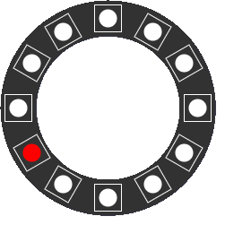
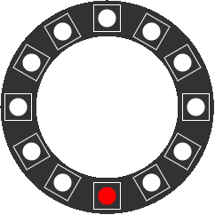
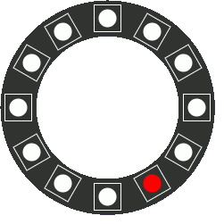
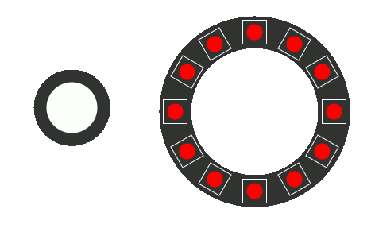

# APPLICAZIONI MUSICALI I

- L'esame si compone di due parti. Una parte di algoritmi da realizzare sulla **pybox** e un test a risposta multipla
- Il test a risposta multipla sarà costituito da 9 domande: 2 punti per ogni risposta corretta, altrimenti 0. (punteggio massimo: 18). Tempo a disposizione: 45 minuti
- La parte di programmazione è costituita da 3 esercizi da scegliere in un gruppo di 4. Ogni esercizio può attribuire *fino a* 4 punti (punteggio massimo: 12)
- La parte di programmazione sarà discussa in classe il giorno dell'esame, ma va consegnata al docente entro il giorno Martedì 11 Luglio, alle ore 23:59

## Esercizi di programmazione

### 1 - RANDOM COLORS
Scrivere un algoritmo che accenda casualmente dei pixel alla frequenza di 0.2 secondi. Quando il Pixel scelto appartiene ad uno dei primi 6, si accenderà con il colore rosso, altrimenti di giallo. Vedere la figura seguente: 



### 2 - SCALA MAGGIORE
- Interpretare i 12 pixel del Ring come se fossero le note della scala cromatica. Da questa estrapolare solo le note della scala maggiore, dove il Do è il pixel 0, il Re il pixel 2, e così via... 
- La scala maggiore sarà quindi interpretata come la seguente lista:

```py
[ 0, 2, 4, 5, 7, 9, 11]
```
- Scrivere un algoritmo che esegua la scala maggiore ascendente e discendente, senza ripetere la nota finale, come nella figura seguente:



- La velocità di riproduzione è arbitraria, e determinata dalla *comprensibilità* del movimento (velocità consigliata: 0.4 secondi)
- Una volta giunta al termine, il ciclo ricomincia, senza ripetere la nota iniziale

### 3 - RIBATTUTI
Scrivere un algoritmo che generi delle rapide pulsazioni (10 pulsazioni da 0.08 secondi) di un pixel scelto a caso, con un colore a caso. La figura seguente ne spiega il comportamento:



### 4 - PULSANTE
Scrivere un algoritmo che utilizzi il pulsante della pybox in questo modo:
- In stato di riposo il *ring* è completamente acceso (colore rosso)
- Quando si preme il pulsante (e si tiene premuto) dei pixel a caso lampeggiano a una velocità di 0.1 millisecondi, sempre con il colore rosso.
- Al rilascio del pulsante si accendono nuovamente tutti i pixel del ring.

Osservare la figura animata per comprenderne il comportamento.

