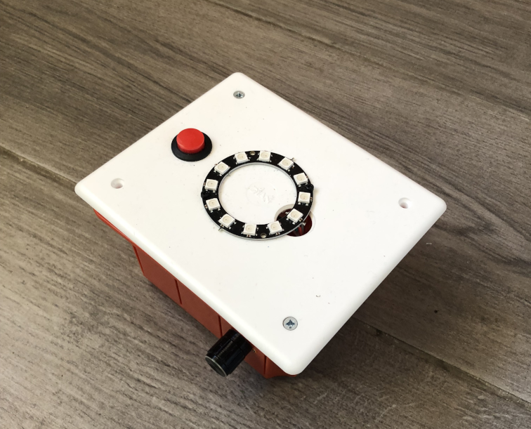

# Welcome to pybox

by [Francesco Bianchi](https://www.francescobianchi.cloud)

`pybox` is a didactical box, equipped with a rp2040 chip (the same present in the [Raspberry Pi Pico](https://www.raspberrypi.com/products/raspberry-pi-pico/)) to manage the following devices:
- a *RGB* led
- a *ledstrip* of 12 pixels
- a potentiometer
- a button
- a mini-speaker

the project aims to help teachers to teach the programming of *microcontrollers* and students to learn by having fun and doing immediately practice without worrying about building any hardware. 
The language used is python (to be clear [CircuitPython](https://circuitpython.org/)) and all you have to do is import a package called `pybox` and his various modules. 
If you want to explore source code and hardware design you can visit this [repo](https://github.com/pythoninabox/pybox2).

In these pages you can find the documentation of the software to manage attached devices and a series of exercises to make practice. 

Modules exported by this package: 

- [`BUTTON`](button.md): black button  
- `COLOR`: contains tuples representing various colors 
- [`LED`](led.md): internal or external led  
- `POT`: integrated pontiometer 
- [`RING`](ring.md): 12 rgb led ring
- `TONE`: tone generator to produce sound from integrated speaker 
- `SIMPLEMIDI`: simple midi sender 
