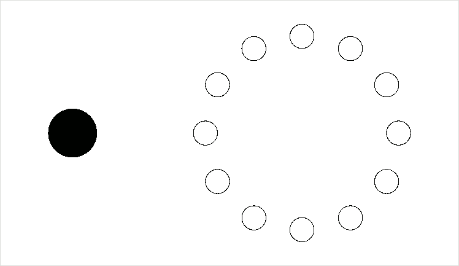
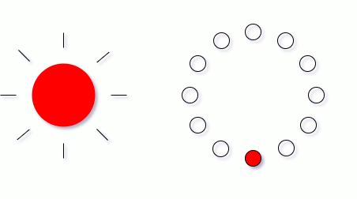

# oggetto SIMPLEBUTTON

## 1 - TOGGLE

Crea un algoritmo che, ogni 100 millisecondi, stampi `PRESSED` se il pulsante è premuto, altrimenti stampi `RELEASED`.

## 2 - TOGGLE LUMINOSO

Crea un algoritmo che accenda dei pixel (scelti casualmente) a distanza di 200 millisecondi mentre il pulsante è premuto.

## 3 - FLAG

Crea un algoritmo che accenda un pixel alla volta, in ordine. Quando giunge all'ultimo pixel, ricomincia da capo.

