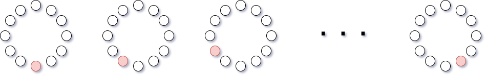
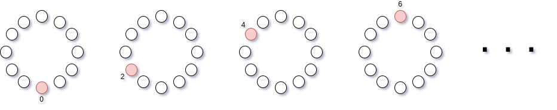
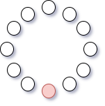

# 1 - SEMAFORO

Creare un semaforo (usando i led `0`, `1` e `2` a cui vengono assegnati rispettivamente i colori `pybox.color.GREEN`, `pybox.color.YELLOW`, `pybox.color.RED`) che si trova nei seguenti stati successivi:

1.  verde per 5 secondi
2.  giallo per 1 secondo
3.  rosso per 6 secondi 

Quando il semaforo è giallo, il verde resta acceso. Quando diventa rosso, il verde e il giallo si spengono. 

Eseguire la sequenza dei 3 stati continuamente

# 2 - DUE SEMAFORI

Creare due semafori (uno usando i led `0`, `1`, `2` e l'altro con i led `6`, `7`, `8`), che gestiscano un incrocio.

-   Che succede al semaforo 2 quando il semaforo 1 è giallo?
-   Individuare gli stati del sistema, quanti sono?
-   Creare il sistema usando le stesse durate dell'esercizio precedente

# 3 - CERCHIO GRADUALE

-   Utilizzare il rosso, colore di default
-   Illuminare l'intero anello, un led alla volta, finché non sia completamente luminoso. 
-   Fra un illuminazione e l'altra passi mezzo secondo
-   Una volta che il cerchio è completamente illuminato, terminare l'esecuzione

# 4 - PASSAGGIO DI LUCE

-   Illuminare un led alla volta, in modo che la luce passi da uno all'altro, sequenzialmente. Non ci saranno mai due led accesi contemporaneamente.
-   Utilizzare il rosso, colore di default
-   Quando si illumina l'ultimo led, ricominciare il ciclo, e così via, indefinitamente.

# 5 - PASSAGGIO DI LUCE A COLORI INTERMITTENTI

Eseguire l'esercizio precedente, con la seguente variazione: 

-   accendere un led rosso quando il led attivo è in posizione pari (`0`, `2`, `4`, ...), giallo quando dispari (`1`, `3`, `5`, ...)

# 6 - PASSAGGIO DI LUCE PARI

Eseguire un passaggio di luce da un pixel all'altro, ma solo sui pixel in posizione pari.

- La velocità è di 0.250 secondi

# 7 - PASSAGGIO DI LUCE ANTIORARIO

Come nell'esercizio 4, ma al contrario.

# 8 - AVANTI E INDIETRO

Creare un passaggio di luce, che inizi dal primo pixel (come nell'esercizio 4) arrivi all'ultimo e poi torni indietro, per poi ricominciare.

- La velocità è di 0.150 secondi

# 9 - RANDOM

Usare il modulo `random` per accendere un pixel scelto a caso ogni 100 millisecondi. Non ci possono essere due pixel accesi contemporaneamente. Quando se ne accende uno, si spegne il precedente.

# 10 - WORM

Creare un `filo` di 3 pixel che si muovono lungo l'anello alla velocità di 50 millisecondi per ogni spostamento.

